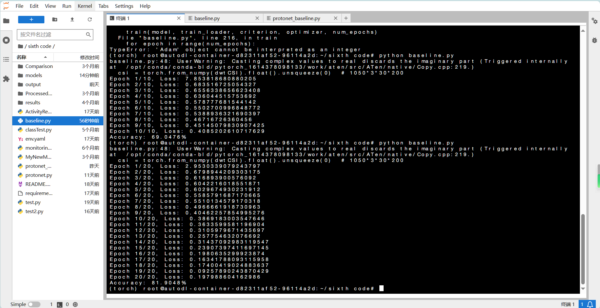
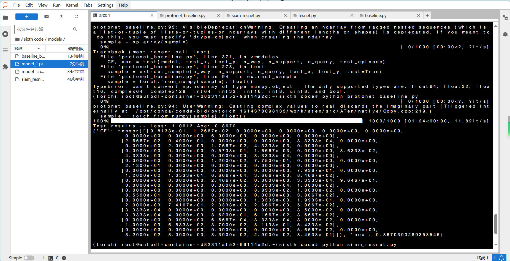
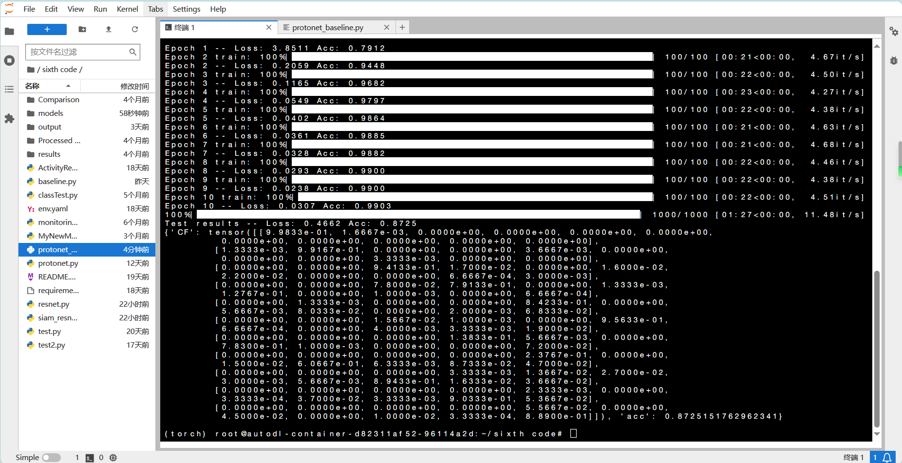
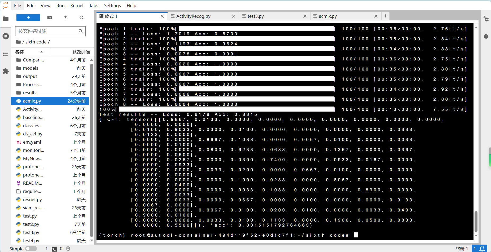
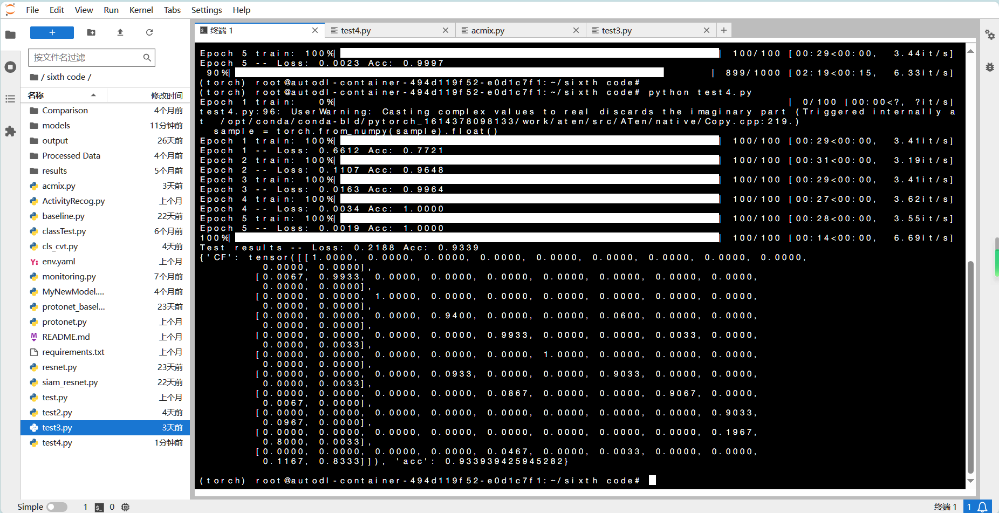
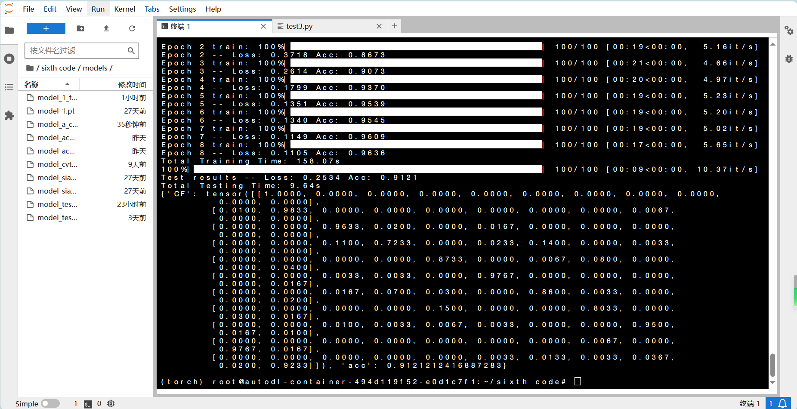
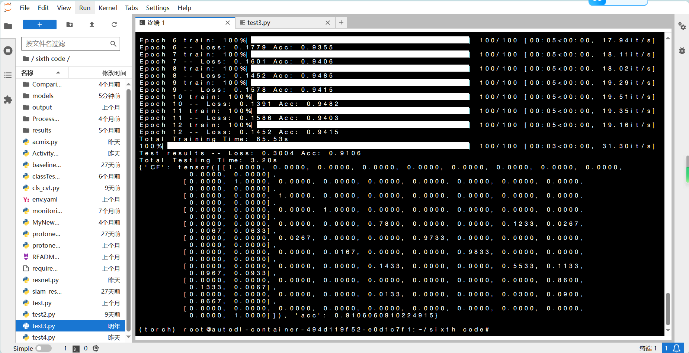
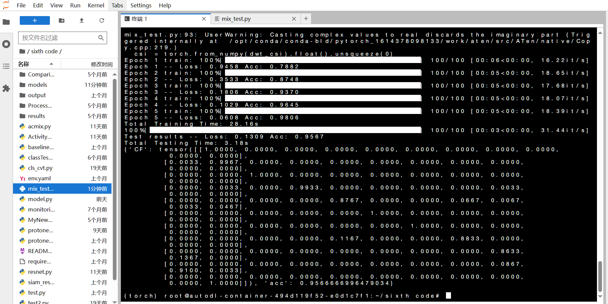

使用CNN和孪生神经网络实现小样本学习的方法构建一个模型，通过使用WIFI信号中CSI数据作为数据集来进行人体活动分类。根据上述要求，用python编写代码来完成模型的构建和训练。
模型所采用的孪生神经网络由特征提取网络和相似度计算网络两部分组成模型采用两个不同的输入，数据样本x1和数据样本x2，两个数据样本通过两个具有相同网络结构、相同网络参数、相同权重的特征提取网络进行特征提取工作，得到两个样本对应的特征向量F(x1)和F(x2)，计算两个特征向量的特征距离后将特征距离向量 D输入相似度计算网络，得到数据样本x1和数据样本x2之间的相似度，最后通过与对照组样本分别计算相似度并进行比对来对人体活动动作进行分类，从而检测跌倒。需要注意的是，两个特征提取网络的网络结构相同，共享相同的网络参数和权重，在模型训练时，两个特征提取网络同时对网络参数和权重进行更新，更新后的网络参数和权重仍然保持一致。

(1).特征提取网络

结构由四个卷积块和一些操作层连接构成，卷积块包含两个卷积块A和两个卷积块B，每两个相同的卷积块后面连接有一个最大池化层，网络最后连接有一个Flatten层。每个卷积块A包含有一个128 通道的卷积层，一个二维批标准化层(BN层)和一个ReLu活层。每个卷积块 B包含有一个 256通道的卷积层，一个二维批标准化层和一个ReLu激活层。卷积块A和卷积块B所采用的卷积层中，其每一个通道上均采用一个尺寸为3x3的二维卷积核，卷积步长设置为1，卷积填充设置为1，填充值为0。卷积块B的卷积层通道数为卷积块A卷积层通道数的两倍。两种卷积块中均在卷积层后连接二维批标准化层对数据进行归一化操作。两种卷积块的激活层均采用ReLu 激活函数。在最大池化层中，两个最大池化层的核尺寸均为2x2，步长设置均为2，这两个最大池化层通过消除非极大值降低了计算复杂度，在减少数据量的同时保留了输入数据的特征。最后，网络通过一个Flatten层，将前面层的输出数据转换为-维数据，输出一个一维的人体活动CSI数据样本的特征向量。特征提取网络将人体活动动作CSI数据样本映射到特征空间，其输入为经过数据预处理操作的人体活动CSI数据样本，输入形式为尺寸是3x30x200的CSI振幅数据矩阵，网络的输出CSI数据样本提取出的特征，输出形式为尺寸是1x89600的一维特征向量。

(2)相似度计算网络

相似度计算网络主要由全连接神经网络构成，网络一共包含四个网络层，其中两个是全连接层，两个是激活层。相似度计算网络的第一个网络层为一个包含89600个神经元的全连接层，第二个全连接层包含512个神经元。两个全连接层之间以一个 ReLu 激活层连接，用于去除网络的线性化，给网络增加非线性。网络最后连接有一个 Sigmoid 激活层，在给网络中的数据引入非线性的同时，将网络的输出限制为一个0至1之间的数值。相似度计算网络的输入是两个人体活动动作CSI数据样本在经过特征提取网络提取出的两个特征向量的特征距离，其形式为一个尺寸是1x89600的特征距离向量。网络的输出为两个数据样本之间的相似度，其形式为一个0至1之间的数值，数值越接近1代表两个数据样本相似度越高，两个数据样本越有可能代表同种人体活动动作，数值越接近0代表两个数据样本相似度越低，两个数据样本越有可能代表不同的人体活动动作。

bedroom数据比meetingroom数据集的准确率更高

**ActivityRecog.py:**
Acc:0.20

**baseline.py:** 
参数设置：batch_size=8, epochs=20; Accuracy: 81.9048%

**protonet_baseline.py:** 
参数设置：n_way = 11 n_support = 4  n_query = 3  max_epoch = 10  epoch_size = 100  encoder:4层conv  Acc:  0.8670

原型网络：
修改点：encoder中增加1层conv_block(hid_dim, hid_dim),精度提高到Acc: 0.8725

修改点：encoder中增加2层conv_block(hid_dim, hid_dim),精度提高到Acc: 0.9158,
此时降低训练次数(max_epoch=5)精度也较高，Acc: 0.9180

**siam_resnet.py:** 
max_epoch=50, batch=16, lr=0.001 Accuracy: 78.5714%

**Acmix.py:** 

def _resnet(block, layers, **kwargs):
    model = ResNet(block, layers, **kwargs)
    return model

def ACmix_ResNet(layers=[3,4,6,3], **kwargs):
    return _resnet(Bottleneck, layers, **kwargs)

减少head数(默认为4)，k_att=7, head=2, k_conv=3, num_classes=11, max_epoch = 5, epoch_size = 100, optimizer=0.01带weight_decay,此时精度为Acc: 0.7700
保持上述条件不变，改变max_epoch=8, 此时训练精度提高，但测试精度下降，Acc: 0.6767
保持上述条件不变，改变optimizer=0.001, 此时训练精度提高，但测试精度下降，Acc: 0.7330
保持上述条件不变，改变resnet 3个layer, 此时训练精度提高，测试精度，Acc: 0.7708

BasicBlock变为3*3, k_att=5, head=2，max_epoch=7, 此时精度Acc: 0.7945
BasicBlock变为3 * 3, k_att=5, head=2，max_epoch=8, 此时精度Acc: 0.8315

BasicBlock变为3*3, k_att=5, head=2，max_epoch=8, 此时精度Acc: 0.8430

BasicBlock:4*4 Acc:0.7070

head为奇数时报错: 
Traceback (most recent call last):
  File "test3.py", line 296, in <module>
    model = load_protonet_conv()
  File "test3.py", line 105, in load_protonet_conv
    model = acmix_model(num_classes=11)
  File "/root/sixth code/acmix.py", line 300, in acmix_model
    model = ResNet(BasicBlock, [1, 1, 1, 1], **kwargs)
  File "/root/sixth code/acmix.py", line 231, in __init__
    self.layer1 = self._make_layer(block, 64, layers[0], k_att, head, k_conv)
  File "/root/sixth code/acmix.py", line 269, in _make_layer
    self.base_width, previous_dilation, norm_layer))
  File "/root/sixth code/acmix.py", line 174, in __init__
    self.conv2 = ACmix(width, width, k_att, head, k_conv, stride=stride, dilation=dilation)
  File "/root/sixth code/acmix.py", line 88, in __init__
    stride=stride)
  File "/root/miniconda3/envs/torch/lib/python3.7/site-packages/torch/nn/modules/conv.py", line 388, in __init__
    False, _pair(0), groups, bias, padding_mode)
  File "/root/miniconda3/envs/torch/lib/python3.7/site-packages/torch/nn/modules/conv.py", line 82, in __init__
    raise ValueError('out_channels must be divisible by groups')
ValueError: out_channels must be divisible by groups

**resnet12.py:** 

use_se=True, max_epoch=5, epoch_size = 100, Acc: 0.9339
use_se=False, max_epoch=5, epoch_size = 100, Acc: 0.9424
use_se=False, max_epoch=8, epoch_size = 100, Acc: 0.9182

resnet:2 * 4  use_se=False, max_epoch=5, epoch_size = 100, Acc: 0.9330
resnet:2 *4  use_se=True, max_epoch=8, epoch_size = 100, Acc: 0.9236

**protonet_baseline.py:**
原来4层conv 精度Acc:0.8533
直接添加ACmix:
    encoder = nn.Sequential(
        conv_block(x_dim[0], hid_dim),
        conv_block(hid_dim, hid_dim),
        conv_block(hid_dim, hid_dim),
        conv_block(hid_dim, hid_dim),

​        ACmix(hid_dim, z_dim),
​        Flatten()
​    )
self.rate1 = torch.nn.Parameter(torch.Tensor([0.5])), max_epoch=5, epoch_size = 100, test_eposide=100, Acc: 0.8715

self.rate1 = torch.nn.Parameter(torch.Tensor(1)), max_epoch=5, epoch_size = 100, test_eposide=1, Acc: 0.9394,(训练测试时间均比下面的短)

改变ACmix位置:
    encoder = nn.Sequential(
        conv_block(x_dim[0], hid_dim),
        ACmix(hid_dim, hid_dim),
        conv_block(hid_dim, hid_dim),
        conv_block(hid_dim, hid_dim),

​        conv_block(hid_dim, z_dim),
​        Flatten()
​    )
rate1=1, rate2=1, max_epoch = 8, epoch_size = 100, test_eposide=100, Acc: 0.9121 ?

加入数据处理部分: kernel_att=7, head=2, max_epoch = 8, epoch_size = 100, test_eposide=100, Acc: 0.8861, 训练时间大幅度减少

加入数据处理部分: kernel_att=7, head=4, max_epoch = 8/5, epoch_size = 100, test_eposide=100, Acc: 0.8739, 训练时间大幅度减少

修改ACmix卷积层:
mix_test.py:
max_epoch = 5, epoch_size = 100, test_eposide=100, Acc: 0.9567/0.9376
max_epoch = 8, epoch_size = 100, test_eposide=100, Acc: 0.9500

max_epoch = 5, epoch_size = 1000, test_eposide=100, Acc: 0.9424
Total Testing Time: 3.18s
{'CF': tensor([[1.0000, 0.0000, 0.0000, 0.0000, 0.0000, 0.0000, 0.0000, 0.0000, 0.0000,
         0.0000, 0.0000],
        [0.0000, 1.0000, 0.0000, 0.0000, 0.0000, 0.0000, 0.0000, 0.0000, 0.0000,
         0.0000, 0.0000],
        [0.0000, 0.0000, 1.0000, 0.0000, 0.0000, 0.0000, 0.0000, 0.0000, 0.0000,
         0.0000, 0.0000],
        [0.0000, 0.0067, 0.0000, 0.9800, 0.0000, 0.0000, 0.0133, 0.0000, 0.0000,
         0.0000, 0.0000],
        [0.0000, 0.0000, 0.0000, 0.0000, 0.8900, 0.0000, 0.0000, 0.0600, 0.0000,
         0.0167, 0.0333],
        [0.0000, 0.0000, 0.0000, 0.0000, 0.0000, 1.0000, 0.0000, 0.0000, 0.0000,
         0.0000, 0.0000],
        [0.0000, 0.0000, 0.0000, 0.0500, 0.0000, 0.0000, 0.9500, 0.0000, 0.0000,
         0.0000, 0.0000],
        [0.0000, 0.0000, 0.0000, 0.0000, 0.1767, 0.0000, 0.0000, 0.8100, 0.0000,
         0.0100, 0.0033],
        [0.0000, 0.0000, 0.0000, 0.0000, 0.0000, 0.0000, 0.0000, 0.0000, 0.9067,
         0.0833, 0.0100],
        [0.0000, 0.0000, 0.0000, 0.0000, 0.0067, 0.0000, 0.0000, 0.0033, 0.0900,
         0.8933, 0.0067],
        [0.0000, 0.0000, 0.0000, 0.0000, 0.0000, 0.0000, 0.0000, 0.0000, 0.0000,
         0.0000, 1.0000]]), 'acc': 0.9481818479299545} 

RTX3080 结果: Acc:0.9018
固定随机种子40可以获得更高的准确率，Acc: 0.9330

ProtoNet(
  (encoder): Sequential(
    (0): Sequential(
      (0): Conv2d(1, 64, kernel_size=(3, 3), stride=(1, 1), padding=(1, 1))
      (1): BatchNorm2d(64, eps=1e-05, momentum=0.1, affine=True, track_running_stats=True)
      (2): ReLU()
      (3): MaxPool2d(kernel_size=2, stride=2, padding=0, dilation=1, ceil_mode=False)
    )
    (1): Sequential(
      (0): Conv2d(64, 64, kernel_size=(3, 3), stride=(1, 1), padding=(1, 1))
      (1): BatchNorm2d(64, eps=1e-05, momentum=0.1, affine=True, track_running_stats=True)
      (2): ReLU()
      (3): MaxPool2d(kernel_size=2, stride=2, padding=0, dilation=1, ceil_mode=False)
    )
    (2): Sequential(
      (0): Conv2d(64, 64, kernel_size=(3, 3), stride=(1, 1), padding=(1, 1))
      (1): BatchNorm2d(64, eps=1e-05, momentum=0.1, affine=True, track_running_stats=True)
      (2): ReLU()
      (3): MaxPool2d(kernel_size=2, stride=2, padding=0, dilation=1, ceil_mode=False)
    )
    (3): Sequential(
      (0): Conv2d(64, 64, kernel_size=(3, 3), stride=(1, 1), padding=(1, 1))
      (1): BatchNorm2d(64, eps=1e-05, momentum=0.1, affine=True, track_running_stats=True)
      (2): ReLU()
      (3): MaxPool2d(kernel_size=2, stride=2, padding=0, dilation=1, ceil_mode=False)
    )
    (4): ACmix(
      (conv1): Conv2d(64, 64, kernel_size=(1, 1), stride=(1, 1))
      (conv2): Conv2d(64, 64, kernel_size=(1, 1), stride=(1, 1))
      (conv3): Conv2d(64, 64, kernel_size=(1, 1), stride=(1, 1))
      (conv_p): Conv2d(2, 32, kernel_size=(1, 1), stride=(1, 1))
      (pad_att): ReflectionPad2d((3, 3, 3, 3))
      (unfold): Unfold(kernel_size=7, dilation=1, padding=0, stride=1)
      (softmax): Softmax(dim=1)
      (fc): Conv2d(6, 9, kernel_size=(1, 1), stride=(1, 1), bias=False)
      (dep_conv): Conv2d(288, 64, kernel_size=(3, 3), stride=(1, 1), padding=(1, 1), groups=32, bias=False)
      (dep_conv1): Sequential(
        (0): Conv2d(288, 64, kernel_size=(3, 3), stride=(1, 1), padding=(1, 1), groups=32)
        (1): BatchNorm2d(64, eps=1e-05, momentum=0.1, affine=True, track_running_stats=True)
        (2): ReLU()
        (3): Conv2d(64, 64, kernel_size=(3, 3), stride=(1, 1), padding=(1, 1))
        (4): BatchNorm2d(64, eps=1e-05, momentum=0.1, affine=True, track_running_stats=True)
        (5): ReLU()
      )
    )
    (5): Flatten()
  )
)

ACmix.py: 增加卷积层
        self.dep_conv1 = nn.Sequential(
            nn.Conv2d(self.kernel_conv * self.kernel_conv * self.head_dim, self.out_planes,
                      kernel_size=self.kernel_conv, bias=True, groups=self.head_dim, padding=1, stride=stride),
            nn.BatchNorm2d(self.out_planes),
            nn.ReLU(),
            nn.Conv2d(self.out_planes, self.out_planes, kernel_size=3, bias=True, padding=1),
            nn.BatchNorm2d(self.out_planes),
            nn.ReLU(),
            nn.Conv2d(self.out_planes, self.out_planes, kernel_size=3, bias=True, padding=1),
            nn.BatchNorm2d(self.out_planes),
            nn.ReLU()
        )
max_epoch = 8, epoch_size = 100, test_eposide=100, Acc:0.9648